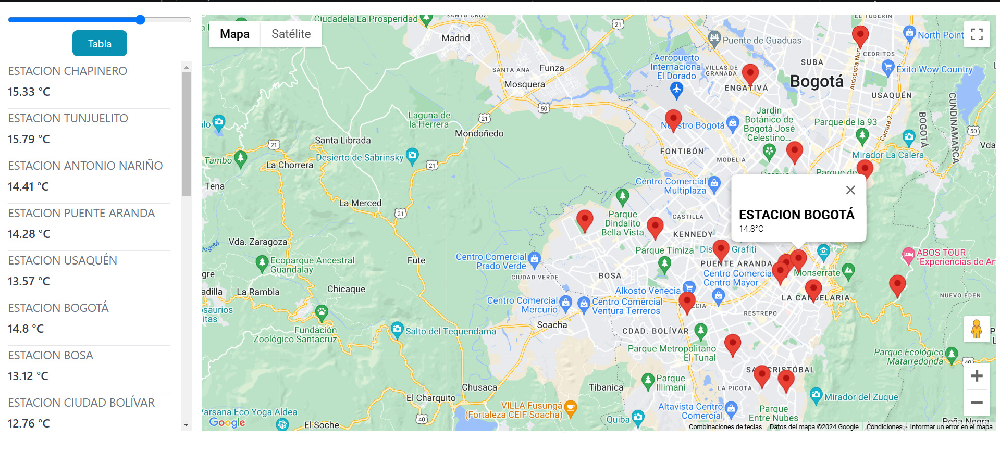
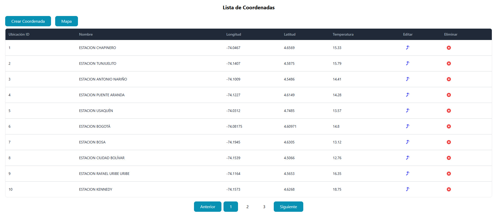
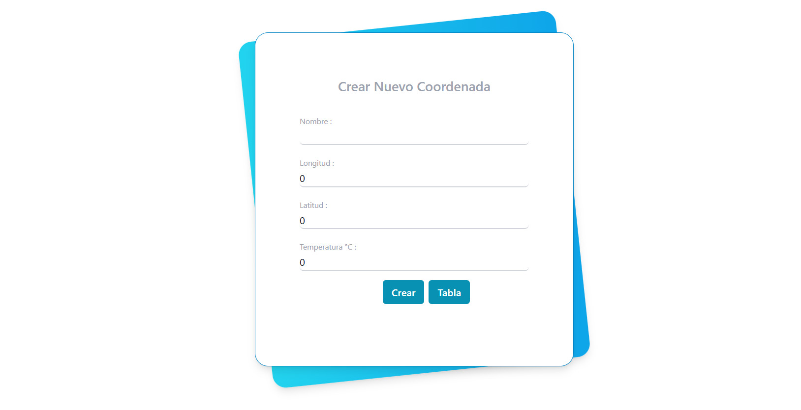
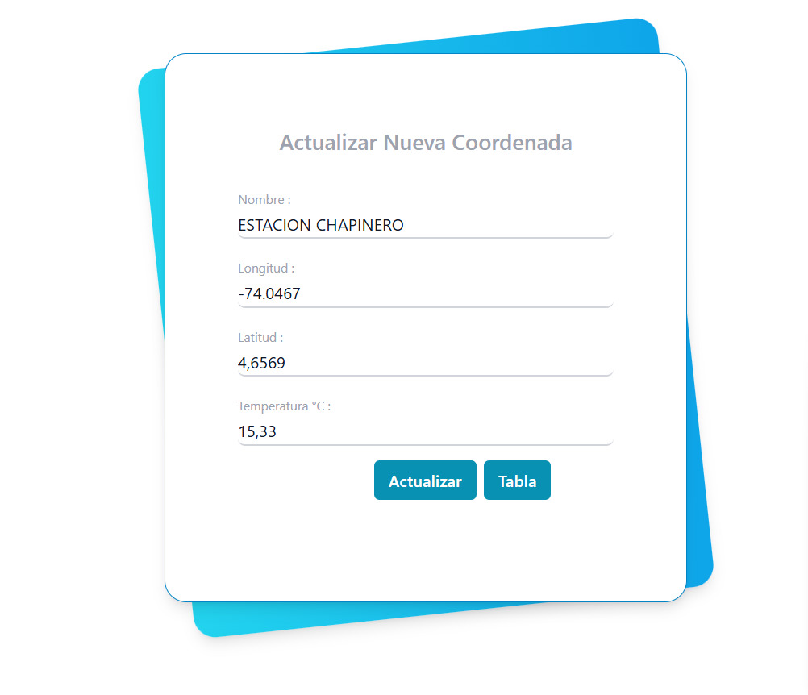

# TemperaturaBogotaFront

Se cuenta con un sistema de estaciones de monitoreo de temperatura dentro de la ciudad de Bogotá, el
cual requiere de un sitio web para presentación en tiempo real de una tabla con el valor actual reportado
por las estaciones.

- Crear base de datos con un listado de ubicaciones con el siguiente formato y con la estructura que
  requiera para el funcionamiento del sistema.
  - Creada en MySQL

- Crear un CRUD que permita
  - Crear un nuevo punto de monitoreo en una ubicación
  - Actualizar las coordenadas y/o el valor de la temperatura monitoreada
  - Eliminar un punto de monitoreo

- Desplegar una vista gráfica sencilla donde se pueda evidenciar
  - Formulario para creación y/o edición de las ubicaciones y su valor de temperatura.
  - Tabla o Mapa que permita visualizar cada una de las ubicaciones y el último valor de temperatura.

# Tecnologias

- Back con Spring Boot java
- Front con Angular y Tailwind css
- Conexion API de Google Maps

## Imagenes

## Running end-to-end tests

Run `ng e2e` to execute the end-to-end tests via a platform of your choice. To use this command, you need to first add a package that implements end-to-end testing capabilities.

## Further help

To get more help on the Angular CLI use `ng help` or go check out the [Angular CLI Overview and Command Reference](https://angular.dev/tools/cli) page.
